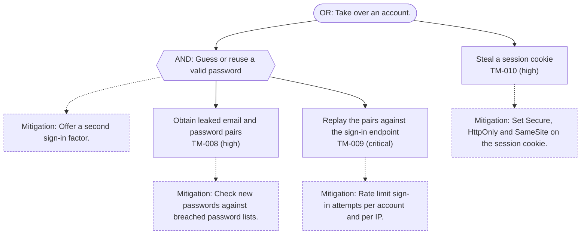

# Attack tree: Sign in (F1)

Root goal: Take over an account.

```mermaid
flowchart TD
    n0(["OR: Take over an account."])
    n1{{"AND: Guess or reuse a valid password"}}
    m1["Mitigation: Offer a second sign-in factor."]
    n2["Obtain leaked email and password pairs<br/>TM-008 (high)"]
    m2["Mitigation: Check new passwords against breached password lists."]
    n3["Replay the pairs against the sign-in endpoint<br/>TM-009 (critical)"]
    m3["Mitigation: Rate limit sign-in attempts per account and per IP."]
    n4["Steal a session cookie<br/>TM-010 (high)"]
    m4["Mitigation: Set Secure, HttpOnly and SameSite on the session cookie."]
    n1 -.-> m1
    n2 -.-> m2
    n1 --> n2
    n3 -.-> m3
    n1 --> n3
    n0 --> n1
    n4 -.-> m4
    n0 --> n4
    classDef mitigation stroke-dasharray: 4 2
    class m1,m2,m3,m4 mitigation
```
